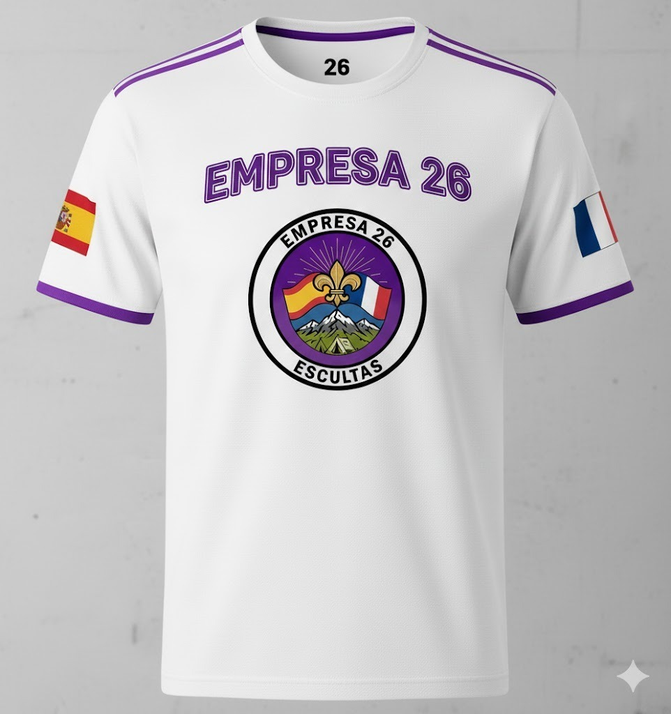
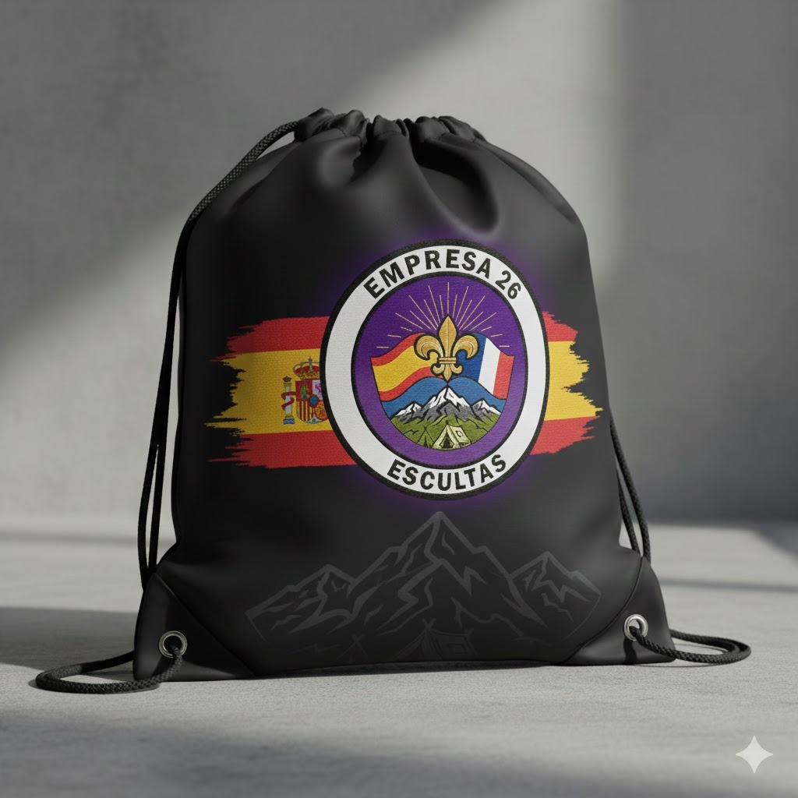
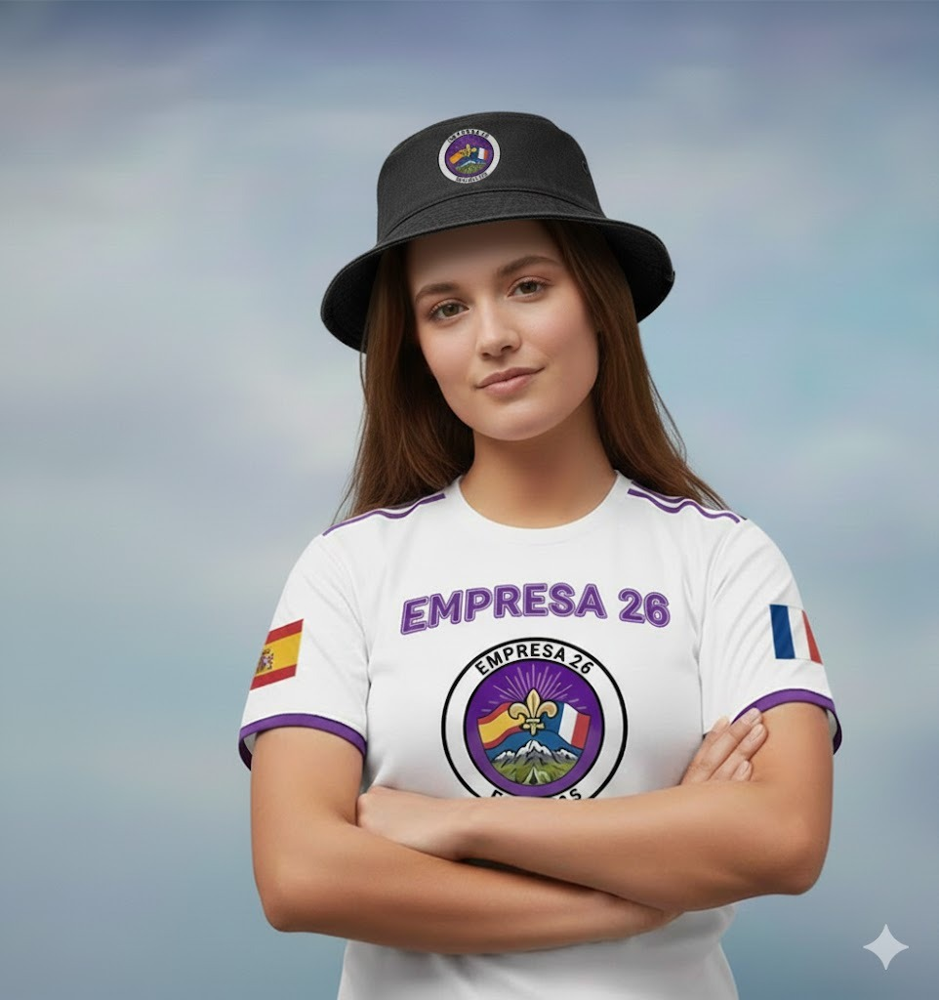

# 🎨 Mejoras Realizadas en la Web - Empresa 25-26

## 📋 Resumen de Cambios

### ✨ Tienda Completamente Renovada

#### 1. **Actualización de Productos con Imágenes Reales**
Se han actualizado todos los productos de la tienda con las imágenes reales proporcionadas:

**Ropa Exclusiva:**
- ✅ Camiseta.jpeg - Camiseta Exclusiva (18€)
- ✅ Gorro.jpeg - Gorro Scout (12€)
- ✅ gorra.png - Gorra Oficial (15€)

**Accesorios y Complementos:**
- ✅ Mochila.jpeg - Mochila Scout (35€)
- ✅ Rinyonera.jpeg - Riñonera Deportiva (14€)
- ✅ pulsera.png - Pulsera Artesanal (5€)

**Modelos en Acción:**
- ✅ Modelo1.jpeg - Colección Completa
- ✅ Modelo2.jpeg - Estilo Scout

#### 2. **Visualización 3D Interactiva** 🔄

Se ha implementado un sistema completo de visualización 3D para todos los productos:

**Características:**
- **Rotación con Mouse/Touch**: Arrastra cualquier producto para rotarlo en 3D
- **Animaciones Suaves**: Transiciones fluidas y naturales
- **Efectos de Profundidad**: Sombras y reflejos realistas
- **Indicadores Visuales**: Hints que muestran "🔄 Arrastra para rotar"
- **Auto-rotación**: Los productos rotan sutilmente al pasar el mouse
- **Zoom en Modelos**: Click en las imágenes de modelos para ver en pantalla completa

**Archivos Creados:**
- `tienda3d.css` - Estilos para efectos 3D
- `tienda3d.js` - Lógica de interactividad 3D

#### 3. **Diseño Premium Mejorado** 💎

**Hero Section:**
- Gradiente vibrante (púrpura a violeta)
- Animaciones de entrada elegantes
- Badge de "Edición Limitada 25-26"
- Partículas animadas de fondo
- Efecto parallax al hacer scroll

**Tarjetas de Producto:**
- Glassmorphism y efectos de cristal
- Bordes animados con gradientes rotativos
- Efecto de brillo al pasar el mouse
- Sombras dinámicas y profundas
- Reflejos sutiles bajo los productos

**Sección de Información:**
- 4 tarjetas con iconos animados
- Efectos de flotación
- Información sobre envío, pago, edición limitada y sostenibilidad

#### 4. **Mejoras de UX/UI** 🎯

**Interactividad:**
- Botones con efecto ripple (ondas al hacer click)
- Lazy loading de imágenes para mejor rendimiento
- Animaciones de entrada escalonadas
- Transiciones suaves en todos los elementos

**Responsive Design:**
- Optimizado para móviles, tablets y desktop
- Touch gestures para dispositivos táctiles
- Hints adaptativos según el dispositivo

**Accesibilidad:**
- Aria-labels en todos los elementos interactivos
- Navegación por teclado mejorada
- Contraste de colores optimizado

#### 5. **Organización de Contenido** 📦

La tienda ahora está organizada en 3 secciones claras:
1. **Ropa Exclusiva** - Camisetas, gorros y gorras
2. **Accesorios y Complementos** - Mochilas, riñoneras y pulseras
3. **Nuestros Productos en Acción** - Modelos mostrando los productos

#### 6. **Rutas Relativas** 🔗

Todas las imágenes ahora usan rutas relativas:
```html



```

Esto asegura que las imágenes funcionen correctamente sin importar dónde se aloje la web.

## 🚀 Características Técnicas

### Archivos Modificados/Creados:
1. ✅ `tienda.html` - Completamente renovado
2. ✅ `tienda3d.css` - Nuevo archivo de estilos 3D
3. ✅ `tienda3d.js` - Nuevo archivo de interactividad 3D
4. ✅ `styles.css` - Estilos base (sin cambios)
5. ✅ `funciones.js` - Funcionalidad base (sin cambios)

### Tecnologías Utilizadas:
- **HTML5** - Estructura semántica
- **CSS3** - Animaciones, gradientes, transformaciones 3D
- **JavaScript ES6+** - Clases, eventos, IntersectionObserver
- **Transform 3D** - Rotación y perspectiva
- **Glassmorphism** - Efectos de cristal esmerilado
- **Responsive Design** - Mobile-first approach

## 🎨 Paleta de Colores

- **Primario**: #667eea → #764ba2 (Gradiente púrpura)
- **Acento**: #ff6b6b (Coral)
- **Highlight**: #06b6d4 (Turquesa)
- **Secundario**: #7c3aed (Morado)
- **Fondo**: Blancos y grises suaves

## 📱 Compatibilidad

- ✅ Chrome/Edge (Chromium)
- ✅ Firefox
- ✅ Safari
- ✅ Dispositivos móviles (iOS/Android)
- ✅ Tablets
- ✅ Desktop

## 🎯 Próximos Pasos Sugeridos

1. **Optimización de Imágenes**: Comprimir las imágenes para carga más rápida
2. **SEO**: Añadir meta tags específicos para cada producto
3. **Analytics**: Integrar Google Analytics para seguimiento
4. **Formularios**: Conectar los botones de compra a formularios reales
5. **Carrito**: Implementar un sistema de carrito de compras

## 📝 Notas Importantes

- ✅ Se eliminaron todas las referencias a archivos con "Ximo" en el nombre
- ✅ Todas las rutas son relativas
- ✅ Los productos tienen IDs únicos para el sistema de likes
- ✅ Las imágenes mantienen su calidad original
- ✅ El diseño es completamente responsive

---

**Fecha de actualización**: 9 de diciembre de 2025
**Versión**: 2.0 - Tienda 3D Interactiva
